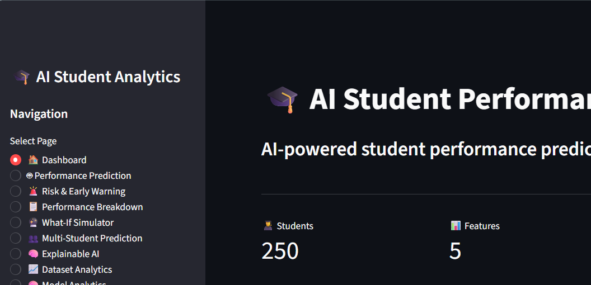
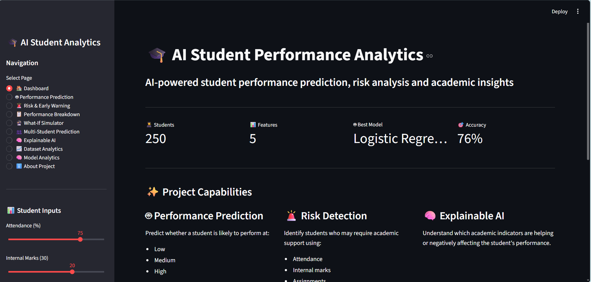
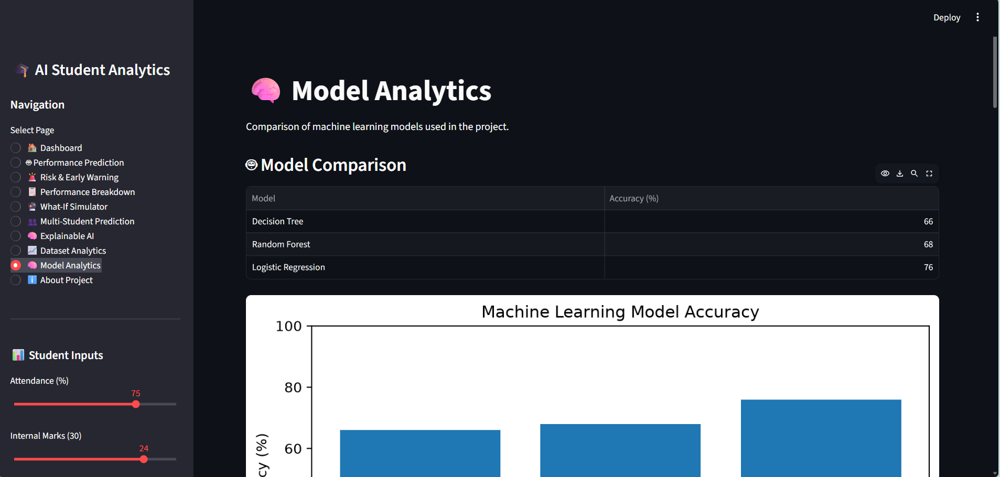
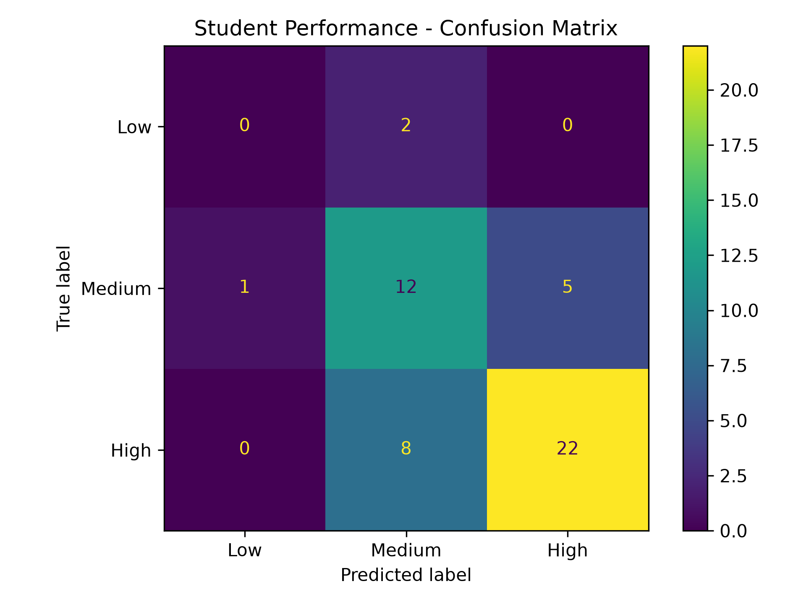
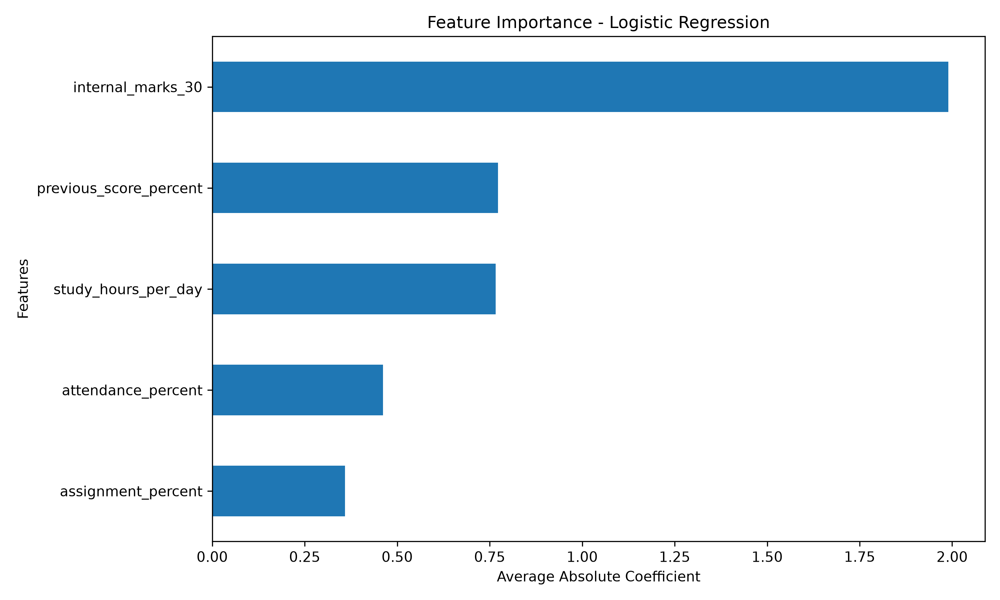

# 🎓 AI Student Performance Analytics System

An AI-powered web application that uses Machine Learning to predict student academic performance, identify academic risk, and provide data-driven insights for early intervention.

## 📌 About the Project

The **AI Student Performance Analytics System** is a Machine Learning-based student analytics application developed using Python and Streamlit.

The system analyzes important academic factors such as:

* Attendance Percentage
* Internal Marks
* Assignment Percentage
* Study Hours per Day
* Previous Score Percentage

Based on these inputs, the system predicts the student's expected performance level as **High, Medium, or Low**.

It also provides confidence scores, risk analysis, performance breakdown, what-if simulation, and model analytics to help understand student performance more effectively.

---

## ✨ Key Features

### 🎯 Student Performance Prediction

Predicts student performance using Machine Learning models based on academic and study-related inputs.

### 📊 Prediction Confidence

Displays the model's prediction confidence and probability distribution for different performance levels.

### ⚠️ Risk & Early Warning System

Identifies students who may require academic attention using attendance, marks, assignment performance, study hours, and previous scores.

### 📈 Performance Breakdown

Provides a detailed breakdown of the major factors contributing to student performance.

### 🔄 What-If Simulator

Allows users to modify student inputs and observe how changes may affect the predicted performance.

### 📁 Multi-Student Prediction

Supports CSV-based prediction for multiple students at once.

### 🔍 Explainable AI

Provides insights into the factors influencing Machine Learning predictions.

### 📊 Dataset Analytics

Provides an overview and analysis of the student performance dataset.

### 🤖 Model Analytics

Compares different Machine Learning models and provides evaluation visualizations.

### 📉 Model Evaluation

Includes evaluation visualizations such as:

* Confusion Matrix
* Feature Importance
* Model Accuracy Comparison

---

## 🔄 Project Workflow

```text
Student Academic Data
        ↓
Data Collection
        ↓
Data Preprocessing
        ↓
Feature Selection
        ↓
Machine Learning Models
        ↓
Performance Prediction
        ↓
Prediction Confidence
        ↓
Risk & Early Warning Analysis
        ↓
Recommendations & Insights
```

---

## 🤖 Machine Learning Models

The project evaluates multiple Machine Learning algorithms:

| Machine Learning Model | Test Accuracy |
| ---------------------- | ------------: |
| Decision Tree          |           66% |
| Random Forest          |           68% |
| Logistic Regression    |           76% |

### 🏆 Best Performing Model

**Logistic Regression — 76% Test Accuracy**

The models are trained using student academic and study-related features to classify students into different performance categories.

---

## 📸 Project Screenshots

### 🏠 Dashboard


### 🎯 Performance Prediction



### ⚠️ Risk & Early Warning



### 📊 Model Analytics





---

## 📊 Model Evaluation

### Confusion Matrix

The confusion matrix is used to evaluate how accurately the Machine Learning model classifies students into different performance categories.



### Feature Importance

Feature importance helps identify which input factors have a stronger influence on student performance predictions.



---

 Technologies Used

 Programming Language

* Python

Machine Learning

* Scikit-learn
* Decision Tree
* Random Forest
* Logistic Regression

 Data Processing

* Pandas
* NumPy

Data Visualization

* Matplotlib

Web Application

* Streamlit

Model Management

* Joblib

Development Tools

* Visual Studio Code
* Git
* GitHub

---

📂 Project Structure

```text
AI_Student_Performance_Analytics_GitHub/
│
├── app.py
├── student_performance_model.pkl
├── requirements.txt
├── README.md
├── .gitignore
├── confusion_matrix.png
├── feature_importance.png
│
├── data/
│   └── student_performance_demo.csv
│
├── src/
│   └── train_model.py
│
└── outputs/
```

---

⚙️ Installation

Clone the repository:

```bash
git clone https://github.com/sheet-al25/AI_Student_Performance_Analytics.git
```

Navigate to the project directory:

```bash
cd AI_Student_Performance_Analytics
```

Install the required dependencies:

```bash
pip install -r requirements.txt
```

---

▶️ Run the Application

Start the Streamlit application using:

```bash
python -m streamlit run app.py
```

The application will open in the browser at:

```text
http://localhost:8501
```

---

📈 Results

The system provides a complete student performance analysis workflow including:

* Student performance classification
* Prediction confidence
* Academic risk identification
* Performance factor analysis
* What-if analysis
* Multi-student prediction
* Machine Learning model comparison
* Confusion matrix visualization
* Feature importance analysis

The current best-performing model achieves **76% test accuracy** on the project dataset.

---
🔮 Future Scope

The project can be further enhanced by:

* Using a larger real-world student dataset
* Adding more academic and behavioral features
* Implementing advanced Machine Learning models
* Adding automated email/SMS alerts for high-risk students
* Developing a teacher/admin dashboard
* Adding database integration
* Deploying the application on a cloud platform
* Implementing continuous model improvement with new student data

---

🎯 Project Objective

The main objective of this project is to use Artificial Intelligence and Machine Learning to support **early identification of academic performance issues** and provide meaningful insights that can help educators take timely action.

---

👩‍💻 Author

**Sheetal Singh**

MCA — Computer Applications & Generative Artificial Intelligence

---

⭐ Acknowledgement

This project was developed as an academic Machine Learning project to demonstrate the practical application of Artificial Intelligence, data analytics, and predictive modeling in the education domain.
